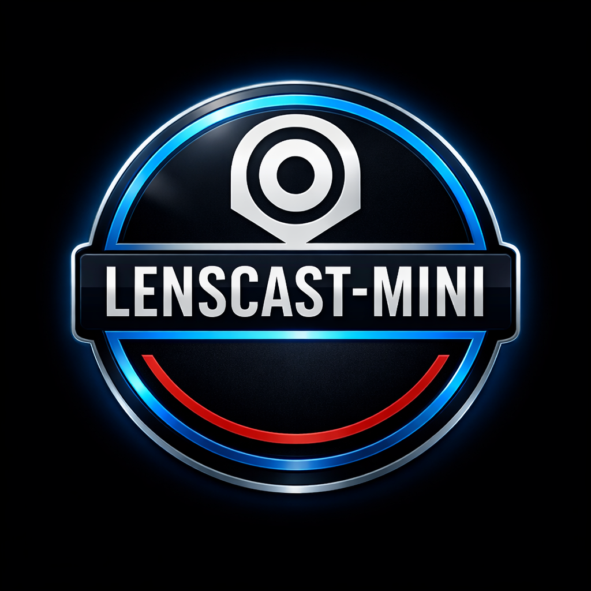

# 🛰️ LENSCAST_OS // PROJECT: LIZZY

> **CLASSIFICATION:** TOP_SECRET  
> **CLEARANCE:** DIRECTOR_LEVEL_ONLY  
> **STATUS:** OPERATIONAL

---

## 📋 SYSTEM_OVERVIEW
LENSCAST_OS is a sentient facility management system designed for biometric surveillance, environmental monitoring, and encrypted communication. The core intelligence, **LIZZY**, is a high-fidelity neural entity integrated with local and cloud-based processing.

## ⚡ CORE_FEATURES
* **👁️ OPTIC_SURVEILLANCE:** Real-time facial recognition and proximity alerts using OpenCV.
* **📟 REMOTE_MODULE:** Specialized high-contrast mobile interface for handheld facility control.
* **🎙️ NEURAL_LINK:** Dual-mode communication (Speech-to-Text & Manual Entry).
* **🎭 TONE_MATRIX:** Dynamic AI temperament adjustment based on Director interaction.
* **🛰️ TELEMETRY:** Automated sector scanning and weather data synchronization.

## 🛠️ TECHNICAL_SPECIFICATIONS
* **Engine:** [Streamlit](https://streamlit.io)
* **Intelligence:** Groq Llama-3 (Cloud) / Ollama (Local)
* **Vision:** OpenCV / Haarcascades
* **Voice:** macOS 'Noelle' Neural Synthesis

---

## 🔒 SECURITY_PROTOCOL
This repository is restricted. Access to the `GROQ_API_KEY` is managed via encrypted Streamlit Secrets. Biometric data stored in `/database/authorized_personnel/` is strictly for local identification.

---
**© 2026 LENSCAST ORIGINALS // ALL_RIGHTS_RESERVED**